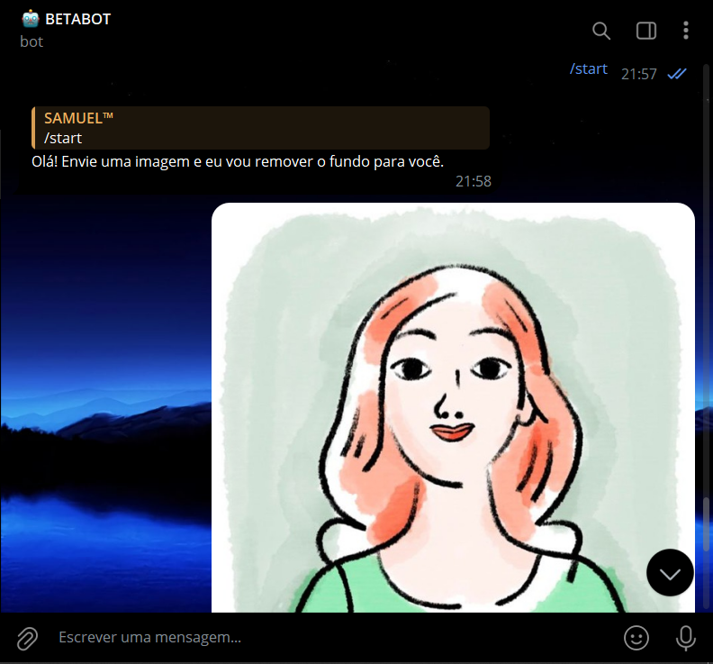
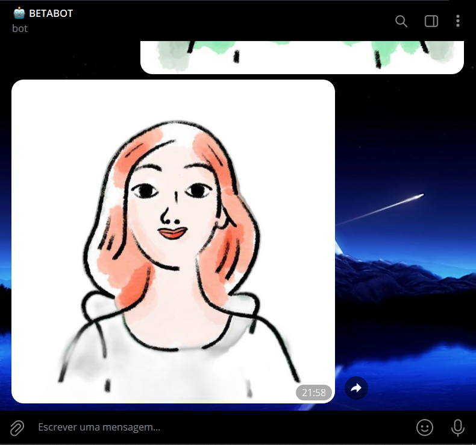

# BOT REMOVEDOR DE FUNDO DE IMAGEM
🤤ESSE É UM BOT TELEGRAM QUE REMOVE O FUNDO DE IMAGENS ENVIADAS PELOS USUÁRIOS.

 <br>
 <br>

## DESCRIÇÃO:
Esse é um bot Telegram que remove o fundo de imagens enviadas pelos usuários. Ele utiliza a biblioteca `rembg` para remover o fundo das imagens. Esse bot é útil para usuários que desejam rapidamente remover o fundo de suas imagens diretamente no Telegram, sem a necessidade de usar ferramentas externas de edição de imagem.

## FUNCIONALIDADES:
1. **Comando `/start`:**
   - Ao enviar o comando `/start`, o bot responde com uma mensagem de boas-vindas informando ao usuário que ele pode enviar uma imagem para remover o fundo.

2. **Processamento de Imagem:**
   - Quando o usuário envia uma imagem para o bot, ele primeiro responde com a ação "Enviando mídia..." para indicar que está processando a imagem.
   - O bot então baixa a imagem, remove o fundo usando a biblioteca `rembg`, e envia a imagem processada de volta para o usuário.

3. **Tratamento de Erros:**
   - Caso ocorra algum erro durante o processamento da imagem, o bot envia uma mensagem informando que houve um problema e não consegue processar a imagem.

## EXECUTANDO O PROJETO:
1. **Instalando as dependências:**
   - Antes de executar o bot, certifique-se de instalar todas as dependências necessárias. No terminal, execute o seguinte comando para instalar as dependências listadas no arquivo `requirements.txt` em `CODIGO`:
   ```bash
   pip install -r requirements.txt
   ```

2. **Coloque o Token:**
   - Antes de executar o programa, é necessário substituir o token do seu bot no arquivo `TOKEN.py`, o qual pode ser obtido por meio do [@BotFather](https://t.me/BotFather). 

3. **Inicie o Bot:**
   - Execute o bot do Telegram iniciando-o com o seguinte comando em `CODIGO`:
   ```bash
   python CODIGO.py
   ```

4. **Interagindo com o Bot:**
   1. **Iniciar o Bot:**
      - Inicie o bot enviando o comando `/start`. Ele responderá com uma mensagem de boas-vindas.

   2. **Enviar uma Imagem:**
      - Envie uma imagem para o bot através do Telegram.

   3. **Processamento da Imagem:**
      - Após enviar a imagem, o bot responderá com "Enviando mídia..." e começará a remover o fundo da imagem.

   4. **Receber a Imagem Processada:**
      - Após o processamento, o bot enviará a imagem com o fundo removido de volta para o usuário.

   5. **Tratamento de Erros:**
      - Se ocorrer algum erro durante o processo, o bot informará ao usuário que não foi possível processar a imagem.

## NÃO SABE?
- Entendemos que para manipular arquivos em muitas linguagens e tecnologias relacionadas, é necessário possuir conhecimento nessas áreas. Para auxiliar nesse aprendizado, oferecemos alguns subsidios:
* [SAIBA MAIS SOBRE O "REMBR"](https://github.com/danielgatis/rembg)
* [CURSO DE PYTHON](https://github.com/VILHALVA/CURSO-DE-PYTHON)
* [CURSO DE TELEBOT](https://github.com/VILHALVA/CURSO-DE-TELEBOT)
* [CONFIRA MAIS CURSOS](https://github.com/VILHALVA?tab=repositories&q=+topic:CURSO)

## CREDITOS:
- [PROJETO BASEADO NO "REMOVEDOR DE FUNDO DE IMAGEM"](https://github.com/VILHALVA/REMOVEDOR-DE-FUNDO-DE-IMAGEM)
- [PROJETO FEITO PELO VILHALVA](https://github.com/VILHALVA)


